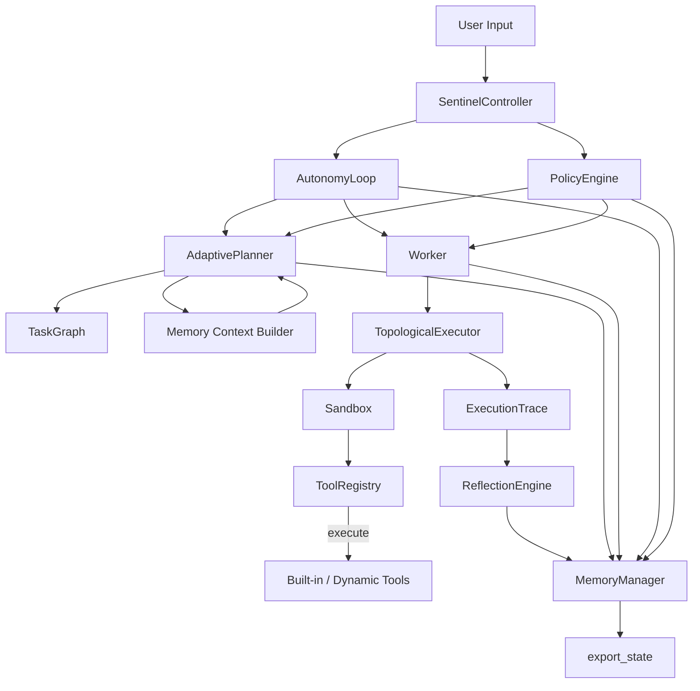

# Sentinel MAX — System Specification

## Architecture Overview
- **Entry points**: `main.py` exposes CLI (`run_cli`), GUI (`run_gui`), and FastAPI server (`run_server`). Each mode constructs a `SentinelController` to orchestrate core subsystems.
- **Controller**: `SentinelController` wires `MemoryManager`, `MemoryContextBuilder`, `PolicyEngine`, DAG `AdaptivePlanner`, `Worker` (policy-aware `TopologicalExecutor`), `ReflectionEngine` (wrapped by `Reflector`), `AutonomyLoop`, `PatchAuditor`, `SelfModificationEngine`, and `HotReloader`. Default tools are registered during initialization.
- **Agent Core**: Adaptive planner emits validated `TaskGraph` DAGs with semantic metadata, Worker executes dependency-aware batches under policy enforcement, AutonomyLoop runs multi-cycle reflective loops with replanning, Reflector stores structured reflections, and data classes in `agent_core.base` capture DAG-oriented traces.
- **Memory**: `MemoryManager` persists symbolic records (JSON) and semantic vectors, and now feeds a memory intelligence layer (`MemoryRanker`, `MemoryFilter`, `MemoryContextBuilder`) that curates context windows for planning and reflection.
- **Policy**: `PolicyEngine` applies safety, permission, determinism, and execution-shaping rules across planning, execution, and reflection, logging policy events for auditability.
- **Tools**: `ToolRegistry` validates self-describing tools (name, version, schema, permissions, determinism) and dispatches them through the sandbox; policy enforcement blocks missing metadata or unsafe arguments.

## Detailed Subsystems
### Controller (`controller.py`)
- Instantiates `MemoryManager`, shared `ToolRegistry`, `Sandbox`, `MemoryContextBuilder`, and `PolicyEngine`.
- Registers default tools: web search, internet extractor, code analyzer, microservice builder, echo generator (prefixed), and the pre-registered `BrowserAgent` singleton.
- Builds `AdaptivePlanner`/`Worker`/`ReflectionEngine` (via `Reflector`)/`AutonomyLoop` on shared state and exposes `process_input` which runs the autonomy loop, then returns the latest reflection or execution summary.
- `export_state` surfaces current memory snapshots and registered tool descriptions.

### Agent Core
- **Data Model (`agent_core/base.py`)**: DAG-focused `ExecutionResult` objects reference `TaskNode` instances; `ExecutionTrace` tracks ordered results plus parallel batches.
- **Planner (`planning/adaptive_planner.py`)**: Performs goal analysis, memory-grounded reasoning via `MemoryContextBuilder`, tool capability matching, subgoal generation, and DAG construction with sanity checkpoints. Plans carry metadata (`origin_goal`, `knowledge_sources`, `tool_choices`, `reasoning_trace`) and fall back to deterministic templates on failure. Plans and reasoning traces are persisted to `plans` and `planning_traces` namespaces.
- **Worker (`agent_core/worker.py`)**: Delegates to `TopologicalExecutor` to honor dependencies, group parallelizable tasks, enforce policy checks before tool calls, and persist outputs/errors to memory (`execution` namespace).
- **AutonomyLoop (`agent_core/autonomy.py`)**: Runs multi-cycle planner→worker→reflection loops with cycle/time/failure limits, repeat-plan detection, policy-aware replanning, goal updates on failure, and typed reflections (`reflection.*`).
- **Reflector (`agent_core/reflection.py`) + ReflectionEngine (`reflection/reflection_engine.py`)**: Produces structured reflections (operational, strategic, self-model, user-preference, plan-critique) with summaries, detected issues, suggested improvements, plan adjustments, and confidence scores. Context is grounded via `MemoryContextBuilder` and persisted under typed namespaces.
- **Sandbox (`agent_core/sandbox.py`)**: Executes callables with restricted `SAFE_BUILTINS` and wraps errors as `SandboxError`.
- **Self-Modification guardrails**: `PatchAuditor`, `SelfModificationEngine`, and `HotReloader` vet and apply code patches with banned-token checks and safe reload hooks.

### Memory Subsystem
- **MemoryManager (`memory/memory_manager.py`)**: Facade combining `SymbolicMemory` (JSON persistence) and `VectorMemory` (semantic search with deterministic hashing fallback). Provides `store_text`, `store_fact`, `query`, `recall_recent`, `semantic_search`, `add` (compatibility), `latest`, and `export_state`.
- **Memory Intelligence (`memory/intelligence.py`)**: `MemoryRanker` scores memories via semantic similarity, timestamp decay, and goal matching; `MemoryFilter` removes noise/duplicates; `MemoryContextBuilder` assembles curated contexts and logs them under `memory_contexts` and `memory_rank_reports`.
- **SymbolicMemory / VectorMemory**: Namespaced fact store with locking, atomic writes, and timestamp metadata; vector store with embedding fallback and cosine search.
- Memory writes across components populate additional namespaces: `planning_traces`, `policy_events`, `memory_contexts`, `memory_rank_reports`, `reflection.*`, and `execution`.

### Policy Layer (`policy/policy_engine.py`)
- Applies safety and preference policies: enforces tool metadata presence, permission allowlist, determinism-first preference (disabling parallelism for non-deterministic tools), parallel execution limits, artifact collision checks, unsafe argument detection, and cycle/unresolved-input rejection via validator integration.
- Integrates with planner (plan shaping), worker (execution blocking), and reflection (policy advice). Logs policy blocks/relaxations/recommendations to `policy_events`.

### Tooling
- **Registry (`tools/registry.py`)**: Thread-safe registry validating `ToolSchema` metadata (semver versioning, permissions, determinism, forbidden builtins) before registration. Supports dynamic loading (`load_dynamic`), lookup (`get`, `call`, `list_tools`, `has_tool`, `describe_tools`), and pre-registers `BrowserAgent`.
- **Built-in tools**: web search, internet extraction, code analysis, microservice generation, echo generator, and browser automation. Policy enforcement requires metadata completeness and safe arguments for every invocation.
- **Schemas (`tools/tool_schema.py`)**: `ToolSchema` and `ToolValidator` enforce metadata completeness, permission declarations, determinism flags, and builtin checks for every tool.

### Interfaces
- **CLI/GUI/Server**: Continue to delegate user inputs to `SentinelController.process_input`, benefiting from adaptive planning, policy enforcement, and reflection-driven replanning.

## Data Flow and Invariants
1. User input -> Controller -> AutonomyLoop records goal to memory.
2. AdaptivePlanner builds validated `TaskGraph` DAGs using memory contexts, tool metadata, and policy guidance; graphs stored in `plans` with semantic metadata and reasoning traces in `planning_traces`.
3. PolicyEngine evaluates plans (permissions, determinism, parallelism, artifact collisions) before execution.
4. Worker executes dependency-ordered batches via `TopologicalExecutor` through the sandboxed tool registry; policy checks guard each node; results and errors written to `execution` namespace with batch ordering.
5. Autonomy loop enforces cycle/time/failure bounds, detects repeat plans, updates goals on failure, and injects typed reflections when progress stalls; reflections may trigger replanning.
6. ReflectionEngine summarizes `ExecutionTrace`, detects issues, proposes plan adjustments, and stores structured reflections plus legacy summaries under typed namespaces.
7. MemoryManager + MemoryIntelligence maintain synchronized symbolic/vector stores and curated contexts; `export_state` exposes both stores and tool metadata for inspection.

**Invariants and Safety Guarantees**
- Tool names are unique; registration rejects duplicates and non-Tool instances. Tool metadata must exist for execution.
- PolicyEngine blocks unsafe permissions, dangerous arguments, excessive parallelism, and artifact collisions; Sandbox restricts exposed built-ins to deterministic primitives; execution errors are wrapped as `SandboxError`.
- TaskGraph validation prevents cycles/dangling requirements; TaskGraph metadata always includes origin goal and reasoning trace when produced by AdaptivePlanner.
- Memory writes are namespaced and timestamped; policy/memory context/rank reports are auditable.
- Autonomy loop halts on failures, timeouts, or empty plans; recovery paths are deterministic and logged; reflections provide confidence scores guiding termination.

## Consistency Checks
- **Unit tests**: `python -m unittest discover sentinel/tests` exercises adaptive planning, policy enforcement, memory intelligence, reflection adjustments, and policy-blocked execution paths.
- **Import audit**: `python -m compileall sentinel` validates module imports and syntax.
- **Runtime wire-up**: `SentinelController.process_input` exercises planner, policy engine, worker, reflector, autonomy, memory, and tool registry end-to-end.

## Change Log
- Added AdaptivePlanner with memory-grounded, policy-aware DAG planning and deterministic fallback.
- Introduced PolicyEngine for safety, preference, and execution constraints; integrated with planner, worker, reflection, and autonomy.
- Added Memory Intelligence layer (ranking/filtering/context building) plus new namespaces for rank reports and contexts.
- Upgraded Reflection to v3 with structured, multi-dimensional outputs and replanning hooks.
- Worker, AutonomyLoop, Controller updated for policy enforcement and replanning.
