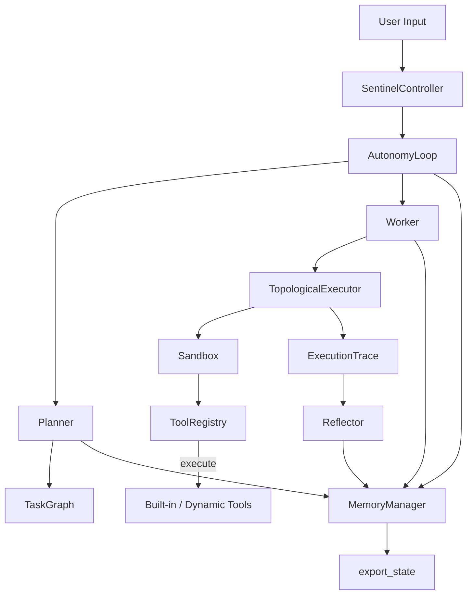

# Sentinel MAX — System Specification

## Architecture Overview
- **Entry points**: `main.py` exposes CLI (`run_cli`), GUI (`run_gui`), and FastAPI server (`run_server`). Each mode constructs a `SentinelController` to orchestrate core subsystems.
- **Controller**: `SentinelController` wires `MemoryManager`, `ToolRegistry`, `Sandbox`, DAG `Planner`, `Worker` (via topological executor), `Reflector`, `AutonomyLoop`, `PatchAuditor`, `SelfModificationEngine`, and `HotReloader`. Default tools are registered during initialization.
- **Agent Core**: Planner now emits validated `TaskGraph` DAGs, Worker executes dependency-aware batches with `TopologicalExecutor`, AutonomyLoop runs multi-cycle reflective loops with runaway protection, Reflector stores typed reflections, and data classes in `agent_core.base` capture DAG-oriented traces.
- **Memory**: `MemoryManager` persists symbolic records (JSON) and semantic vectors, providing unified recall, search, and fact storage APIs used across planning, execution, reflection, and autonomy bookkeeping.
- **Tools**: `ToolRegistry` validates self-describing tools (name, version, schema, permissions, determinism) and dispatches them through the sandbox. Built-in tools include web search, internet extraction, code analysis, microservice generation, browser automation, and deterministic echo generation.
- **Safety**: `Sandbox` limits built-ins during tool execution; `PatchAuditor` and `SelfModificationEngine` safeguard dynamic code paths; tool validation rejects forbidden builtins and missing permissions; AutonomyLoop enforces cycle/time/failure bounds.

## Detailed Subsystems
### Controller (`controller.py`)
- Instantiates `MemoryManager`, shared `ToolRegistry`, and `Sandbox`.
- Registers default tools: web search, internet extractor, code analyzer, microservice builder, echo generator (prefixed), and the pre-registered `BrowserAgent` singleton.
- Builds Planner/Worker/Reflector/AutonomyLoop on shared state and exposes `process_input` which runs the autonomy loop, then returns the latest reflection or execution summary.
- `export_state` surfaces current memory snapshots and registered tool descriptions.

### Agent Core
- **Data Model (`agent_core/base.py`)**: DAG-focused `ExecutionResult` objects reference `TaskNode` instances; `ExecutionTrace` tracks ordered results plus parallel batches.
- **Planner (`agent_core/planner.py`)**: Builds `TaskGraph` DAGs using tool metadata, validates them via `GraphValidator`, and records plan graphs in memory (`plans` namespace).
- **Worker (`agent_core/worker.py`)**: Delegates to `TopologicalExecutor` to honor dependencies, group parallelizable tasks, and persist outputs/errors to memory (`execution` namespace).
- **AutonomyLoop (`agent_core/autonomy.py`)**: Runs multi-cycle planner→worker→reflection loops with cycle/time/failure limits, repeat-plan detection, goal updates on failure, and typed reflections (`reflection.operational`, `reflection.strategic`, `reflection.self-model`, `reflection.user-preference`).
- **Reflector (`agent_core/reflection.py`)**: Summarizes execution traces with timestamps and persists summaries under typed reflection namespaces for downstream responses.
- **Sandbox (`agent_core/sandbox.py`)**: Executes callables with restricted `SAFE_BUILTINS` and wraps errors as `SandboxError`.
- **Self-Modification guardrails**: `PatchAuditor`, `SelfModificationEngine`, and `HotReloader` exist to vet and apply code patches with banned-token checks and safe reload hooks.

### Memory Subsystem
- **MemoryManager (`memory/memory_manager.py`)**: Facade combining `SymbolicMemory` (JSON persistence) and `VectorMemory` (semantic search with deterministic hashing fallback). Provides `store_text`, `store_fact`, `query`, `recall_recent`, `semantic_search`, `add` (compatibility), `latest`, and `export_state`.
- **SymbolicMemory**: Namespaced fact store with locking, atomic writes, and timestamp metadata.
- **VectorMemory**: Adds embeddings keyed by namespace; gracefully falls back when models are unavailable.
- All agent core components persist their outputs through `MemoryManager`, ensuring consistent recall for planning, execution, reflection, and health signals.

### Tooling
- **Registry (`tools/registry.py`)**: Thread-safe registry validating `ToolSchema` metadata (semver versioning, permissions, determinism, forbidden builtins) before registration. Supports dynamic loading (`load_dynamic`), lookup (`get`, `call`, `list_tools`, `has_tool`, `describe_tools`), and pre-registers `BrowserAgent`.
- **Built-in tools**:
  - `web_search`: deterministic search placeholder for structured results.
  - `internet_extract`: scrapes, cleans, summarizes HTML with optional vector storage.
  - `code_analyzer`: AST-based safety scoring and recommendations.
  - `microservice_builder`: audits generated FastAPI apps with sandboxed execution.
  - `echo` (generated via `generate_echo_tool`): configurable prefix responder.
  - `BrowserAgent`: DOM-only automation with Playwright/CDP hybrid controls.
- **Schemas (`tools/tool_schema.py`)**: `ToolSchema` and `ToolValidator` enforce metadata completeness, permission declarations, deterministic flags, and builtin checks for every tool.
- All tool execution is funneled through the sandbox via the worker to maintain deterministic, safe behavior.

### Interfaces
- **CLI**: Runs an interactive loop, piping user inputs to `SentinelController.process_input` and printing reflections/summaries.
- **GUI**: Tkinter application launched by `run_gui_app` (not modified here) built on the same controller pipeline.
- **Server**: FastAPI app (`server/main.py`) started via `uvicorn` in `run_server`, exposing API routes backed by the same core components.

## Data Flow and Invariants
1. User input -> Controller -> AutonomyLoop records goal to memory.
2. Planner builds validated `TaskGraph` DAGs based on tool availability/metadata; graphs stored in `plans` namespace.
3. Worker executes dependency-ordered batches via `TopologicalExecutor` through the sandboxed tool registry; results and errors written to `execution` namespace with batch ordering.
4. AutonomyLoop enforces cycle/time/failure bounds, detects repeat plans, updates goals on failure, and injects typed reflections when progress stalls.
5. Reflector summarizes `ExecutionTrace` with timestamps, storing reflections for future responses; controller favors latest reflection for replies.
6. MemoryManager maintains synchronized symbolic/vector stores; `export_state` exposes both stores and tool metadata for inspection.

**Invariants and Safety Guarantees**
- Tool names are unique; registration rejects duplicates and non-Tool instances.
- Sandbox restricts exposed built-ins to deterministic primitives; execution errors are wrapped as `SandboxError`.
- Memory writes are namespaced and timestamped; export preserves both symbolic and vector state for replay/debugging.
- Autonomy loop halts on failures, timeouts, or empty plans; recovery paths are deterministic and logged.
- Reflection summaries always include UTC timestamps for traceability.

## Consistency Checks
- **Import + syntax validation**: `python -m compileall sentinel` ensures modules import and compile cleanly.
- **Runtime wire-up**: `SentinelController.process_input` exercises planner, worker, reflector, autonomy, memory, and tool registry end-to-end.
- **Circular dependency expectations**: Subsystems interact through well-defined facades (`ToolRegistry`, `MemoryManager`); no circular imports are present in core modules.

## Diagrams
The Mermaid diagram above reflects the current controller→autonomy→tool→memory flow. Regenerate it whenever component boundaries or data flow change.

## Change Log
- Document regenerated to reflect current controller wiring, agent core flow, memory integration, toolset, safety guards, and interface modes.
