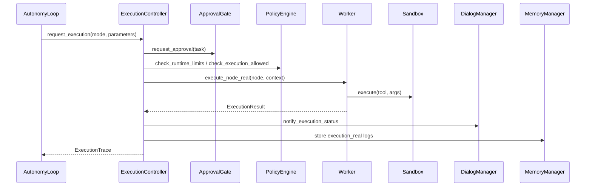
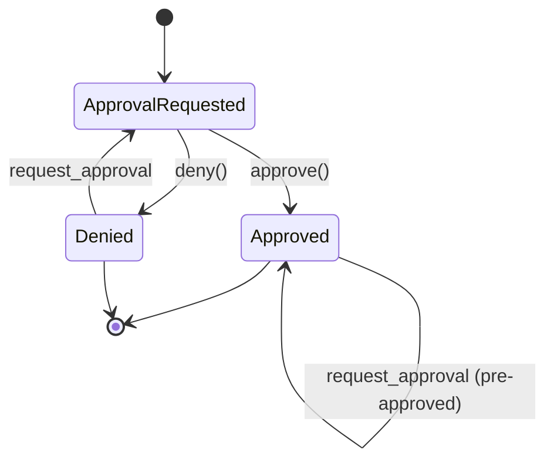
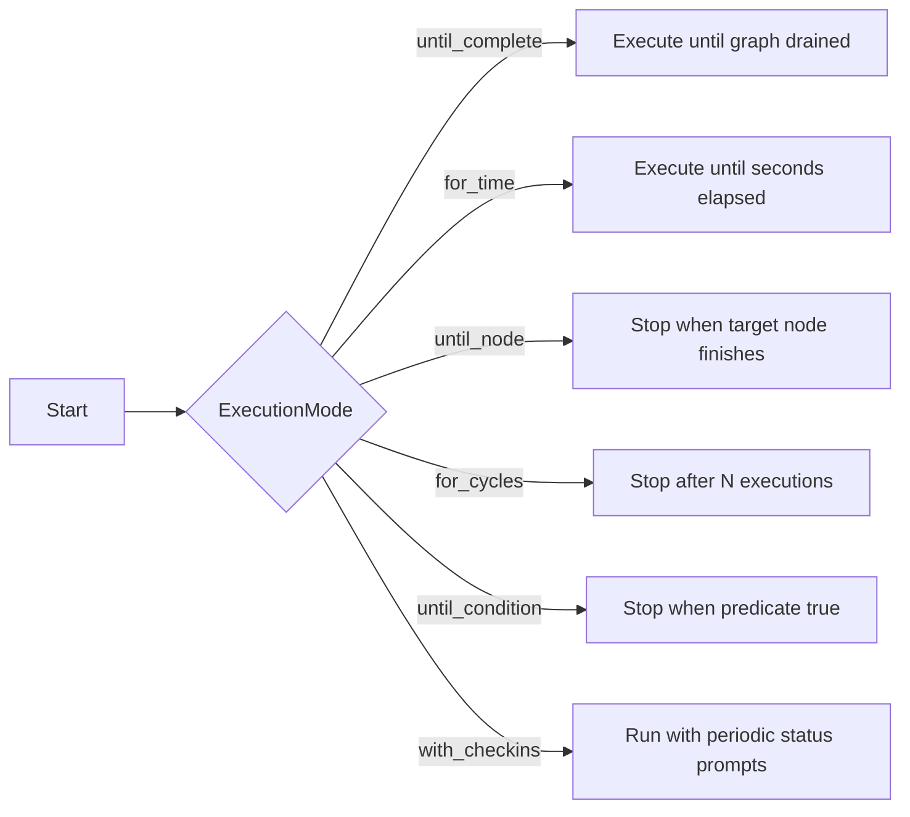

# Sentinel MAX — System Specification

## Architecture Overview
- **Entry points**: `main.py` exposes CLI (`run_cli`), GUI (`run_gui`), and FastAPI server (`run_server`). Each mode constructs a `SentinelController` to orchestrate core subsystems.
- **Controller**: `SentinelController` wires `MemoryManager`, `MemoryContextBuilder`, `WorldModel`, `DialogManager`, `PolicyEngine`, DAG `AdaptivePlanner`, `Worker` (policy-aware `TopologicalExecutor`), `ReflectionEngine` (wrapped by `Reflector`), `AutonomyLoop`, `PatchAuditor`, `SelfModificationEngine`, and `HotReloader`. It now instantiates a conversation stack (`IntentEngine`, `NLToTaskGraph`, `ConversationController`) that normalizes user text into deterministic `NormalizedGoal` statements and executes pre-built TaskGraphs via `AutonomyLoop.run_graph`. Default tools remain registered during initialization.
- **Agent Core**: Adaptive planner emits validated `TaskGraph` DAGs with semantic metadata, Worker executes dependency-aware batches under policy enforcement, AutonomyLoop runs multi-cycle reflective loops with replanning, Reflector stores structured reflections, SimulationSandbox provides in-memory predictions, and data classes in `agent_core.base` capture DAG-oriented traces.
- **Multi-Agent Coordination Layer**: `agents.multi_agent_engine.MultiAgentEngine` orchestrates planner, critic, simulation, optimization, research, and tool-evolution agents. It detects capability gaps, requests new tool proposals, benchmarks candidates inside the `SimulationSandbox`, and applies autonomy rules via `ToolAutonomyPolicy` and `PolicyEngine` before optionally integrating new tools into the registry. The coordinator now accepts both normalized goals and externally generated TaskGraphs from the conversation pipeline.
- **Memory**: `MemoryManager` persists symbolic records (JSON) and semantic vectors, and now feeds a memory intelligence layer (`MemoryRanker`, `MemoryFilter`, `MemoryContextBuilder`) that curates context windows for planning and reflection.
- **Policy**: `PolicyEngine` applies safety, permission, determinism, and execution-shaping rules across planning, execution, and reflection, logging policy events for auditability.
- **Tools**: `ToolRegistry` validates self-describing tools (name, version, schema, permissions, determinism) and dispatches them through the sandbox; policy enforcement blocks missing metadata or unsafe arguments.
- **Autonomous Research Engine**: Dedicated pipeline that orchestrates deterministic web search, web extraction, ranking, domain knowledge extraction, tool semantics discovery, predictive effect modeling (ToolEffectPredictorV2), and semantic storage. Outputs feed the SimulationSandbox, AdaptivePlanner, and DialogManager for transparent summaries and richer planning metadata.

```mermaid
graph TD
    UserInput[User Input] --> Controller[SentinelController]
    Controller --> Policy[PolicyEngine]
    Controller --> WorldModel
    Controller --> Dialog[DialogManager]
    Controller --> Autonomy[AutonomyLoop]
    Controller --> MultiAgent[MultiAgentEngine]
    Autonomy --> Planner[AdaptivePlanner]
    Autonomy --> ExecController[ExecutionController]
    ExecController --> Approval[ApprovalGate]
    ExecController --> Worker
    Planner --> Plan[TaskGraph]
    Planner --> MemoryIntelligence
    Planner --> WorldModel
    Dialog --> WorldModel
    MemoryIntelligence[Memory Context Builder] --> Planner
    MultiAgent --> Planner
    MultiAgent --> Critic[Critic Agent]
    MultiAgent --> Simulation[Simulation Agent]
    MultiAgent --> Optimization[Optimization Agent]
    MultiAgent --> Research[Research Agent]
    MultiAgent --> ToolEvolution[ToolEvolutionAgent]
    ToolEvolution --> ToolRegistry
    Worker --> Executor[TopologicalExecutor]
    Worker --> SimulationSandbox
    Executor --> Sandbox
    Sandbox --> ToolRegistry
    SimulationSandbox --> ToolRegistry
    SimulationSandbox --> WorldModel
    Policy --> Planner
    Policy --> Worker
    Policy --> ExecController
    ToolRegistry -->|execute| Tools[Built-in / Dynamic Tools]
    SimulationSandbox --> Planner
    Executor --> Trace[ExecutionTrace]
    ExecController --> RealTrace[ExecutionTrace (real)]
    Trace --> ReflectionEngine
    RealTrace --> ReflectionEngine
    SimulationSandbox --> ReflectionEngine
    ReflectionEngine --> Memory[MemoryManager]
    Research[Autonomous Research Engine] --> SimulationSandbox
    Research --> Memory
    Research --> Planner
    Planner --> Memory
    Worker --> Memory
    Autonomy --> Memory
    Policy --> Memory
    Memory --> Export[export_state]
```

## Detailed Subsystems
### Controller (`controller.py`)
- Instantiates `MemoryManager`, shared `ToolRegistry`, `Sandbox`, `MemoryContextBuilder`, and `PolicyEngine`.
- Registers default tools: web search, internet extractor, code analyzer, microservice builder, echo generator (prefixed), and the pre-registered `BrowserAgent` singleton.
- Builds `AdaptivePlanner`/`Worker`/`ReflectionEngine` (via `Reflector`)/`AutonomyLoop` on shared state and exposes `process_input` which runs the autonomy loop, then returns the latest reflection or execution summary.
- `export_state` surfaces current memory snapshots and registered tool descriptions.

### Agent Core
- **Data Model (`agent_core/base.py`)**: DAG-focused `ExecutionResult` objects reference `TaskNode` instances; `ExecutionTrace` tracks ordered results plus parallel batches; simulation metadata enriches summaries and reflections.
- **Planner (`planning/adaptive_planner.py`)**: Performs goal analysis, memory-grounded reasoning via `MemoryContextBuilder`, world-model-guided domain and resource classification, tool capability matching, subgoal generation, and DAG construction with sanity checkpoints. Plans carry metadata (`origin_goal`, `domain`, `domain_capabilities`, `resources`, `knowledge_sources`, `tool_choices`, `reasoning_trace`, `simulation_predictions`, `plan_score`) and fall back to deterministic templates on failure. Plans and reasoning traces are persisted to `plans` and `planning_traces` namespaces. `AutonomyLoop.run_graph` now executes externally-built TaskGraphs from the conversational translator.
- **Worker (`agent_core/worker.py`)**: Delegates to `TopologicalExecutor` to honor dependencies, group parallelizable tasks, enforce policy checks before tool calls, persist simulation previews under the `simulations` namespace, and persist outputs/errors to memory (`execution` namespace).
- **AutonomyLoop (`agent_core/autonomy.py`)**: Runs multi-cycle planner→worker→reflection loops with cycle/time/failure limits, repeat-plan detection, policy-aware replanning, goal updates on failure, and typed reflections (`reflection.*`).
- **Reflector (`agent_core/reflection.py`) + ReflectionEngine (`reflection/reflection_engine.py`)**: Produces structured reflections (operational, strategic, self-model, user-preference, plan-critique) with summaries, detected issues, suggested improvements, plan adjustments, and confidence scores. Context is grounded via `MemoryContextBuilder` and persisted under typed namespaces.
- **Sandbox (`agent_core/sandbox.py`)**: Executes callables with restricted `SAFE_BUILTINS` and wraps errors as `SandboxError`.
- **Simulation Sandbox (`simulation/sandbox.py`)**: Provides a virtual filesystem overlay, predicts tool effects, estimates benchmark characteristics, and returns `SimulationResult` objects. Integrates with AdaptivePlanner (plan scoring and side-effect-aware dependencies), Worker (pre-execution simulation persisted to memory), and ReflectionEngine (expected vs actual comparisons, warnings, optimizations).
- **Simulation Sandbox (`simulation/sandbox.py`)**: Provides a virtual filesystem overlay, predicts tool effects (multi-file writes, side-effects, runtime/failure likelihood), and returns `SimulationResult` objects. Integrates with AdaptivePlanner (plan scoring, predicted effects metadata, side-effect-aware dependencies), Worker (pre-execution simulation persisted to memory and anomaly detection), and ReflectionEngine (expected vs actual comparisons, warnings, optimizations). Defaults to ToolEffectPredictorV2 consuming research-derived semantic profiles.
- **Self-Modification guardrails**: `PatchAuditor`, `SelfModificationEngine`, and `HotReloader` vet and apply code patches with banned-token checks and safe reload hooks.
- **Multi-Agent Layer (`agents/multi_agent_engine.py`)**: `MultiAgentEngine` wires PlannerAgent (first-pass plans + capability metadata), CriticAgent (hole detection, missing tools), SimulationAgent (sandbox previews), OptimizationAgent (parallelization and warning mitigation), ResearchAgent (knowledge fills via world-model alignment), and ToolEvolutionAgent (gap detection, candidate generation, simulation/benchmarking, autonomy enforcement). Decisions and feedback are written to memory namespaces such as `plan_feedback`, `goal_assessments`, and `tool_evolution`.
- **Autonomous Research Engine (`research/research_engine.py`)**: Coordinates deterministic web search + internet extraction, SourceRanker scoring (relevance, integrity, authority, novelty, density), domain knowledge extraction, tool semantics discovery, semantic model construction, and ToolEffectPredictorV2 training. Stores artifacts under `research.raw`, `research.ranked`, `research.domain`, `research.tools`, `research.models`, `research.predictor_updates`, and `research.anomalies`, feeds SimulationSandbox semantic profiles, enriches AdaptivePlanner metadata, and exposes summaries via DialogManager helper methods.

### Execution Subsystem
- **ExecutionController (`execution/execution_controller.py`)**: Executes `TaskGraph` nodes in topological order under multiple `ExecutionMode` values (`until_complete`, `for_time`, `until_node`, `for_cycles`, `until_condition`, `with_checkins`). Validates simulations, enforces `PolicyEngine` runtime limits, requests approval via `ApprovalGate`, dispatches real runs to `Worker.execute_node_real`, triggers periodic check-ins through `DialogManager`, and logs results to `MemoryManager` under `execution_real`.
- **ApprovalGate (`execution/approval_gate.py`)**: Tracks pending approval text and approval state, prompts the `DialogManager`, and gates real execution checks in both `ExecutionController` and `Worker`.
- **DialogManager integration**: Presents approval prompts and execution status notifications via `prompt_execution_approval` and `notify_execution_status`, persisting concise updates to symbolic memory for audit.
- **Execution Modes**: Time-bound, cycle-bound, target-node, predicate, and check-in driven modes provide bounded autonomy for real actions. Modes are user-selectable through `AutonomyLoop.run` and delegated to `ExecutionController.request_execution`.
- **Logging and reflection**: Real execution traces are written to `execution_real`; `AutonomyLoop` reflects on these traces after every run to keep operational memory up to date.







### Tool Autonomy and Evolution
- **ToolAutonomyPolicy (`tools/tool_autonomy_policy.py`)**: Configures `autonomy_mode` (`ask`, `review`, `autonomous`) plus gates for benchmark improvement, simulation success, and policy approval. MultiAgentEngine consumes this policy when evaluating new tools.
- **ToolEvolutionAgent**: Detects missing or unbound tools in task graphs, generates candidate tool specs from world-model gaps, simulates candidates inside `SimulationSandbox`, estimates performance via `BenchmarkFacade`, compares against existing tools when provided, and applies acceptance rules. Acceptance requires simulation success, policy approval (permissions subset), and non-regressing benchmarks when enabled. Modes:
  - `ask`: records a user request artifact without integrating.
  - `review`: auto-generates candidates and awaits approval.
  - `autonomous`: auto-integrates candidates into `ToolRegistry` when metrics are superior.
- **Coordination Flow**: `MultiAgentEngine.coordinate` runs plan→critic→simulation→optimization, then invokes ToolEvolutionAgent if a gap is found. Candidate specs are simulated and benchmarked before `PolicyEngine` and autonomy rules decide whether to register tools (in-memory only) or request user/reviewer input.

### Memory Subsystem
- **MemoryManager (`memory/memory_manager.py`)**: Facade combining `SymbolicMemory` (JSON persistence) and `VectorMemory` (semantic search with deterministic hashing fallback). Provides `store_text`, `store_fact`, `query`, `recall_recent`, `semantic_search`, `add` (compatibility), `latest`, and `export_state`.
- **Memory Intelligence (`memory/intelligence.py`)**: `MemoryRanker` scores memories via semantic similarity, timestamp decay, and goal matching; `MemoryFilter` removes noise/duplicates; `MemoryContextBuilder` assembles curated contexts and logs them under `memory_contexts` and `memory_rank_reports`.
- **SymbolicMemory / VectorMemory**: Namespaced fact store with locking, atomic writes, and timestamp metadata; vector store with embedding fallback and cosine search.
- Memory writes across components populate additional namespaces: `planning_traces`, `policy_events`, `memory_contexts`, `memory_rank_reports`, `reflection.*`, and `execution`.

### World Model (`world/model.py`)
- Maintains domain registry for coding, multi-service, pipelines, devops, web tasks, research, optimization, and automation; domains capture capabilities and typical goals and can be extended at runtime.
- Models resources (file resources, code artifacts, services, pipelines, browser contexts, data sources) with adjacency-list dependency graphs that express `requires`/`produces` relationships.
- Provides queries for domain detection (`get_domain`), capability listing, required resource prediction, and dependency forecasting driven by goal text.
- Persists world knowledge to symbolic memory (cached at startup, incrementally updated) so planning and dialog context share consistent state.

### Policy Layer (`policy/policy_engine.py`)
- Applies safety and preference policies: enforces tool metadata presence, permission allowlist, determinism-first preference (disabling parallelism for non-deterministic tools), parallel execution limits, artifact collision checks, unsafe argument detection, runtime limits (max time, cycles, consecutive failures), real-tool allowlists, and cycle/unresolved-input rejection via validator integration.
- Integrates with planner (plan shaping), worker (execution blocking), execution controller (runtime/approval constraints), and reflection (policy advice). Logs policy blocks/relaxations/recommendations to `policy_events`.

### Tooling
- **Registry (`tools/registry.py`)**: Thread-safe registry validating `ToolSchema` metadata (semver versioning, permissions, determinism, forbidden builtins) before registration. Supports dynamic loading (`load_dynamic`), lookup (`get`, `call`, `list_tools`, `has_tool`, `describe_tools`), and pre-registers `BrowserAgent`.
- **Built-in tools**: web search, internet extraction, code analysis, microservice generation, echo generator, and browser automation. Policy enforcement requires metadata completeness and safe arguments for every invocation.
- **Schemas (`tools/tool_schema.py`)**: `ToolSchema` and `ToolValidator` enforce metadata completeness, permission declarations, determinism flags, and builtin checks for every tool.

### Interfaces
- **CLI/GUI/Server**: Continue to delegate user inputs to `SentinelController.process_input` / `process_conversation`, benefiting from the conversational normalization layer, adaptive planning, policy enforcement, and reflection-driven replanning.
- **Conversation Layer**: `IntentEngine` → `NLToTaskGraph` → `ConversationController` pipeline normalizes requests, resolves parameters, scans ambiguities, and emits validated TaskGraphs that flow into `AutonomyLoop.run_graph` with memory-backed persona preferences (Professional + Concise).
- **DialogManager**: Maintains session context (last intent, active goals, partial tasks, pending clarifications), resolves pronouns, persists persona preferences, and records dialog turns alongside task graph metadata.
- **GUI**: Tkinter UI adds a chat window, task-graph visualizer, multi-agent activity log view, world-model/simulation inspector, benchmark summary display, and controls for simulation-only runs, sandbox execution, graph/log display, and rollback. `interface/gui_bridge.py` routes GUI events through DialogManager, IntentEngine, NL→TaskGraph translation, AdaptivePlanner (via MultiAgentEngine), and sandbox execution.

## Data Flow and Invariants
1. User input -> Controller -> DialogManager/IntentEngine normalize to `NormalizedGoal` with persona preferences and ambiguity checks.
2. WorldModel classifies the goal into a domain, surfaces capabilities, predicts required resources, and stores dependencies in symbolic memory for downstream components.
3. NL→TaskGraph translation builds validated `TaskGraph` DAGs (including validation/benchmark nodes) using world-model hints, tool metadata, policy guidance, and multi-agent feedback; graphs stored in `task_graphs`/`plans` with semantic metadata and reasoning traces in `planning_traces`.
4. PolicyEngine evaluates plans (permissions, determinism, parallelism, artifact collisions) before execution.
5. ExecutionController iterates nodes in topological order, validates simulations, enforces runtime limits, requests approvals, dispatches `execute_node_real` to `Worker`, and writes real execution logs to `execution_real` while DialogManager issues status updates.
6. Worker executes dependency-ordered batches via `TopologicalExecutor` through the sandboxed tool registry; simulations run before real calls and are stored to `simulations`; policy checks guard each node; results and errors written to `execution` namespace with batch ordering.
7. Autonomy loop enforces mode-specific bounds, detects repeat plans, updates goals on failure, and injects typed reflections when progress stalls; reflections may trigger replanning.
8. ReflectionEngine summarizes `ExecutionTrace`, merges simulation warnings/predictions, proposes plan adjustments, and stores structured reflections plus legacy summaries under typed namespaces.
9. MemoryManager + MemoryIntelligence maintain synchronized symbolic/vector stores and curated contexts; `export_state` exposes both stores and tool metadata for inspection.
10. Research loop: Internet search → extraction → ranking → semantics → simulation (ToolEffectPredictorV2) → planner metadata enrichment; outputs stored under `research.*` namespaces for reuse and anomaly correction.

**Invariants and Safety Guarantees**
- Tool names are unique; registration rejects duplicates and non-Tool instances. Tool metadata must exist for execution.
- PolicyEngine blocks unsafe permissions, dangerous arguments, excessive parallelism, and artifact collisions; Sandbox restricts exposed built-ins to deterministic primitives; execution errors are wrapped as `SandboxError`.
- TaskGraph validation prevents cycles/dangling requirements; TaskGraph metadata always includes origin goal and reasoning trace when produced by AdaptivePlanner.
- Memory writes are namespaced and timestamped; policy/memory context/rank reports are auditable.
- Autonomy loop halts on failures, timeouts, or empty plans; recovery paths are deterministic and logged; reflections provide confidence scores guiding termination.
- ApprovalGate must be satisfied before any real tool invocation; `PolicyEngine` enforces runtime limits (time, cycles, consecutive failures) and per-tool allowlists before `Worker.execute_node_real` runs.
- Real execution traces are stored under `execution_real` with task/tool/success metadata for reflective analysis and auditing.

## Consistency Checks
- **Unit tests**: `python -m unittest discover sentinel/tests` exercises adaptive planning, policy enforcement, memory intelligence, reflection adjustments, and policy-blocked execution paths.
- **Import audit**: `python -m compileall sentinel` validates module imports and syntax.
- **Runtime wire-up**: `SentinelController.process_input` exercises planner, policy engine, worker, reflector, autonomy, memory, and tool registry end-to-end.

### Tool Autonomy Test Scenarios
- **Missing tool in TaskGraph**: CriticAgent flags the gap; ToolEvolutionAgent generates a spec and processes it through autonomy rules according to the configured mode.
- **Simulation failure**: Candidate rejected when `SimulationSandbox` reports warnings or missing required parameters.
- **Benchmark regression**: Candidates with lower `relative_speed` than baselines are declined when improvement is required.
- **Ask mode**: Generates a user-facing request artifact and does not integrate.
- **Review mode**: Auto-generates the candidate and waits for reviewer approval before registry changes.
- **Autonomous mode**: Registers a candidate into `ToolRegistry` when policy, simulation, and benchmark criteria pass.

## Change Log
- Added AdaptivePlanner with memory-grounded, policy-aware DAG planning and deterministic fallback.
- Introduced PolicyEngine for safety, preference, and execution constraints; integrated with planner, worker, reflection, and autonomy.
- Added Memory Intelligence layer (ranking/filtering/context building) plus new namespaces for rank reports and contexts.
- Upgraded Reflection to v3 with structured, multi-dimensional outputs and replanning hooks.
- Worker, AutonomyLoop, Controller updated for policy enforcement and replanning.
- Added WorldModel foundation layer with domain registry, resource/dependency graphs, dialog integration, and planner metadata enrichment.
- Added conversation pipeline (IntentEngine, NL→TaskGraph, ConversationController), AutonomyLoop graph execution, GUI chat/insight panels, and GUI bridge controls for simulation-only runs and rollbacks.

## BLOCK 6 — LONG-HORIZON PROJECT ENGINE (ADDED)

### New Components

- `ProjectMemory`
- `LongHorizonProjectEngine`
- `ProjectDependencyGraph`
- `PolicyEngine`
- `DialogManager`

### New Capabilities

- Multi-day project reasoning
- Versioned persistent goals
- Dependency-aware scheduling
- Project-level reflections
- Autonomy constraints and refinement limits
- Human-readable progress & issue reporting

### New Data Flow

AutonomyLoop → ProjectEngine → PolicyEngine → Planner → ExecutionController → ReflectionEngine → ProjectEngine → DialogManager

### Operational Notes

- `LongHorizonProjectEngine` composes `ProjectMemory`, `PolicyEngine`, `ProjectDependencyGraph`, and `DialogManager` to deliver governed long-horizon runs.
- Plans must be cycle-free with resolved dependencies; depth is computed automatically when absent and compared against policy thresholds.
- `ProjectMemory` enforces schema validation and atomic, versioned writes for goals, plans, dependency graphs, execution logs, and reflections.
- `DialogManager` can emit composite reports combining overview, progress, and dependency diagnostics for human operators.

